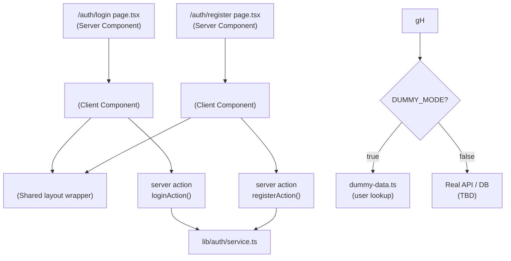

# attanDANCE — Authentication Plan

---

## 1. Overview

Two authentication pages — **Login** and **Register** — serve as the gateway to the attanDANCE platform. They leverage the existing dummy-data system for frontend development and will be swapped to real auth later via `DUMMY_DATA_ENABLED`.

| Page | Route | Purpose |
|---|---|---|
| Login | `/auth/login` | Existing users sign in with email + password |
| Register | `/auth/register` | New members create an account |

---

## 2. Route & File Structure

```
app/
├── (auth)/                          # Route group (no shared layout wrapping)
│   ├── login/
│   │   └── page.tsx                 # Login page (Server Component shell)
│   └── register/
│       └── page.tsx                 # Register page (Server Component shell)
│
components/
├── ui/                              # shadcn primitives (already exists)
│   ├── button.tsx
│   ├── input.tsx                    # * needs creation via shadcn
│   ├── label.tsx                    # * needs creation via shadcn
│   ├── card.tsx                     # * needs creation via shadcn
│   └── separator.tsx                # * needs creation via shadcn
│
├── features/
│   └── auth/
│       ├── login-form.tsx           # 'use client' — Login form with validation
│       ├── register-form.tsx        # 'use client' — Register form with validation
│       ├── auth-card.tsx            # Shared card wrapper (branding, illustration side)
│       └── social-buttons.tsx       # Future: OAuth providers
│
lib/
├── auth/
│   ├── schemas.ts                   # Zod schemas for login + register
│   ├── service.ts                   # login() / register() — switches dummy ↔ real
│   ├── actions.ts                   # Next.js Server Actions (form submission)
│   └── types.ts                     # Auth-specific types (AuthResult, SessionUser, etc.)
```

Route group `(auth)` keeps the auth pages separate from the main app layout (no navbar, no sidebar).

---

## 3. Component Architecture

### 3.1 Page Shell → Form Component

Each page is a **Server Component** that renders a client form. This keeps the page lightweight and lets the form handle interactivity.



### 3.2 `AuthCard` — Shared Shell

```
┌──────────────────────────────────────────┐
│  ┌─────────────┐   ┌──────────────────┐  │
│  │             │   │  attanDANCE logo │  │
│  │ Illustration│   │                  │  │
│  │   / Brand   │   │  Login Form      │  │
│  │   Graphic   │   │  or              │  │
│  │             │   │  Register Form   │  │
│  │             │   │                  │  │
│  │             │   │  Link to other   │  │
│  └─────────────┘   └──────────────────┘  │
└──────────────────────────────────────────┘
```

Two-column layout on desktop (`md:`), single column (form only) on mobile.

---

## 4. Form Schemas (Zod + React Hook Form)

### 4.1 Login Schema

```typescript
// lib/auth/schemas.ts
import { z } from 'zod';

export const loginSchema = z.object({
  email: z
    .string()
    .min(1, 'Email is required')
    .email('Please enter a valid email'),
  password: z
    .string()
    .min(1, 'Password is required')
    .min(8, 'Password must be at least 8 characters'),
});

export type LoginInput = z.infer<typeof loginSchema>;
```

### 4.2 Register Schema

```typescript
export const registerSchema = z
  .object({
    fullName: z
      .string()
      .min(2, 'Name must be at least 2 characters')
      .max(100, 'Name must be under 100 characters'),
    email: z
      .string()
      .min(1, 'Email is required')
      .email('Please enter a valid email'),
    password: z
      .string()
      .min(8, 'Password must be at least 8 characters')
      .regex(/[A-Z]/, 'Must contain at least one uppercase letter')
      .regex(/[0-9]/, 'Must contain at least one number'),
    confirmPassword: z.string(),
  })
  .refine((data) => data.password === data.confirmPassword, {
    message: 'Passwords do not match',
    path: ['confirmPassword'],
  });

export type RegisterInput = z.infer<typeof registerSchema>;
```

---

## 5. Auth Service Layer

### 5.1 `lib/auth/service.ts`

```typescript
// Dummy-mode: check against users in dummy-data.ts
// Real-mode:  call external auth API / DB

export async function login(input: LoginInput): Promise<AuthResult> {
  if (isDummyDataEnabled()) {
    // Find user by email, compare plain-text password to hashed (simulate)
    const user = dummyData.users.find(u => u.email === input.email);
    if (!user) return { success: false, error: 'Invalid email or password' };
    // In dummy mode, accept any password for the matching email
    return { success: true, user: mapUserToSessionUser(user) };
  }
  // TODO: real auth
}

export async function register(input: RegisterInput): Promise<AuthResult> {
  if (isDummyDataEnabled()) {
    const exists = dummyData.users.find(u => u.email === input.email);
    if (exists) return { success: false, error: 'Email already registered' };
    // Simulate creation — return success
    return { success: true, user: { id: 'new-user', email: input.email, fullName: input.fullName } };
  }
  // TODO: real registration
}
```

### 5.2 Return Types

```typescript
// lib/auth/types.ts
export interface SessionUser {
  id: string;
  email: string;
  fullName: string;
  role: string;       // role name from Roles table
  avatar?: string;
}

export type AuthResult =
  | { success: true; user: SessionUser }
  | { success: false; error: string };
```

---

## 6. Server Actions

### 6.1 `lib/auth/actions.ts`

```typescript
'use server';

import { loginSchema, registerSchema } from './schemas';
import { login, register } from './service';

export async function loginAction(
  prevState: AuthFormState,
  formData: FormData
): Promise<AuthFormState> {
  const parsed = loginSchema.safeParse({
    email: formData.get('email'),
    password: formData.get('password'),
  });

  if (!parsed.success) {
    return { errors: parsed.error.flatten().fieldErrors };
  }

  const result = await login(parsed.data);
  if (!result.success) {
    return { serverError: result.error };
  }

  // Set cookie / session — see §7
  return { success: true };
}

export type AuthFormState = {
  errors?: Record<string, string[]>;
  serverError?: string;
  success?: boolean;
};
```

---

## 7. Session / State Management

### Approach: Cookie-based session (for now)

Since we are in dummy-data mode and don't have a real backend, we use a lightweight approach:

1. **On successful login/register**: Set an `auth-token` cookie (simulated JWT or just a user-id lookup key).
2. **Middleware** (`middleware.ts`): Read the cookie on protected routes. If absent, redirect to `/auth/login`.
3. **`getSession()`** helper: Server-side function that reads the cookie and returns the `SessionUser` from dummy data.

```typescript
// lib/auth/session.ts
import { cookies } from 'next/headers';
import { dummyData } from '@/lib/dummy-data';
import type { SessionUser } from './types';

export async function getSession(): Promise<SessionUser | null> {
  const cookieStore = await cookies();
  const token = cookieStore.get('auth-token')?.value;
  if (!token) return null;
  // Dummy mode: token = user_id
  const user = dummyData.users.find(u => u.id === token);
  if (!user) return null;
  return {
    id: user.id,
    email: user.email,
    fullName: user.full_name,
    role: dummyData.roles.find(r => r.id === user.role_id)?.name ?? 'Member',
  };
}
```

### Future: Replace with NextAuth.js / Auth.js when real auth is needed.

---

## 8. UI Design Specs

### 8.1 Styling Approach

- **Fonts**: `--font-heading` (JetBrains Mono) for the logo + headings; `--font-sans` (Noto Sans) for body/form text.
- **Theme**: Dark default with the club's energetic aesthetic. Deep backgrounds, accent glows.
- **Card**: Glassmorphism card (`backdrop-filter: blur`, semi-transparent border).
- **Form elements**: shadcn Input, Label, Button (already exists).

### 8.2 Login Page Wireframe

```
┌──────────────────────────────────────────────────────────┐
│                                                          │
│    ┌──────────────────┐    ┌─────────────────────────┐   │
│    │                  │    │  🔥 attanDANCE           │   │
│    │   Dance          │    │                          │   │
│    │   Silhouette     │    │  Welcome back            │   │
│    │   / Abstract     │    │                          │   │
│    │   Shapes         │    │  ┌────────────────────┐  │   │
│    │                  │    │  │ Email              │  │   │
│    │                  │    │  └────────────────────┘  │   │
│    │                  │    │                          │   │
│    │                  │    │  ┌────────────────────┐  │   │
│    │                  │    │  │ Password           │  │   │
│    │                  │    │  └────────────────────┘  │   │
│    │                  │    │                          │   │
│    │                  │    │  [ Sign In ]  disabled?  │   │
│    │                  │    │                          │   │
│    │                  │    │  No account? Register →  │   │
│    └──────────────────┘    └─────────────────────────┘   │
│                                                          │
└──────────────────────────────────────────────────────────┘
```

### 8.3 Register Page Wireframe

```
┌──────────────────────────────────────────────────────────┐
│                                                          │
│    ┌──────────────────┐    ┌─────────────────────────┐   │
│    │                  │    │  🔥 attanDANCE           │   │
│    │   (same          │    │                          │   │
│    │    illustration) │    │  Join the crew           │   │
│    │                  │    │                          │   │
│    │                  │    │  ┌────────────────────┐  │   │
│    │                  │    │  │ Full Name          │  │   │
│    │                  │    │  └────────────────────┘  │   │
│    │                  │    │  ┌────────────────────┐  │   │
│    │                  │    │  │ Email              │  │   │
│    │                  │    │  └────────────────────┘  │   │
│    │                  │    │  ┌────────────────────┐  │   │
│    │                  │    │  │ Password           │  │   │
│    │                  │    │  └────────────────────┘  │   │
│    │                  │    │  ┌────────────────────┐  │   │
│    │                  │    │  │ Confirm Password   │  │   │
│    │                  │    │  └────────────────────┘  │   │
│    │                  │    │                          │   │
│    │                  │    │  [ Create Account ]      │   │
│    │                  │    │                          │   │
│    │                  │    │  Already a member? Login │   │
│    └──────────────────┘    └─────────────────────────┘   │
│                                                          │
└──────────────────────────────────────────────────────────┘
```

---

## 9. Form States

Every form must handle these states explicitly:

| State | Visual |
|---|---|
| **Idle** | Clean form, enabled inputs, enabled submit button |
| **Validating** | Real-time inline errors under fields (on blur) |
| **Submitting** | Submit button shows spinner + "Signing in…"; all inputs disabled |
| **Field Error** | Red border + error message below the field |
| **Server Error** | Toast or banner at top: "Invalid email or password" |
| **Success** | Redirect to `/` (protected dashboard/feed) |

### Client-side validation triggers:
- `onBlur` — validate individual field
- `onSubmit` — validate all fields before calling server action

---

## 10. Integration with Dummy Data

### Login (dummy mode):
- Accepts **any password** for emails that exist in `dummyData.users`
- Returns the matched user + role
- Sets `auth-token` cookie with the user's UUID

### Register (dummy mode):
- Checks email uniqueness against `dummyData.users`
- Returns success (does not actually mutate the read-only dummy data)
- Sets `auth-token` cookie with a placeholder ID

### Test credentials (for development):
| Email | Password | Role |
|---|---|---|
| `sakura.tanaka@attandance.com` | anything (≥8 chars) | Admin |
| `kai.yamamoto@attandance.com` | anything (≥8 chars) | Instructor |
| `riko.sato@attandance.com` | anything (≥8 chars) | Member |

---

## 11. Middleware (Route Protection)

```typescript
// middleware.ts (root of project)
import { NextResponse } from 'next/server';
import type { NextRequest } from 'next/server';

const protectedRoutes = ['/'];
const authRoutes = ['/auth/login', '/auth/register'];

export function middleware(request: NextRequest) {
  const token = request.cookies.get('auth-token')?.value;
  const { pathname } = request.nextUrl;

  // Redirect authenticated users away from auth pages
  if (token && authRoutes.includes(pathname)) {
    return NextResponse.redirect(new URL('/', request.url));
  }

  // Redirect unauthenticated users to login
  if (!token && protectedRoutes.some(r => pathname.startsWith(r)) && pathname !== '/auth/login' && pathname !== '/auth/register') {
    return NextResponse.redirect(new URL('/auth/login', request.url));
  }

  return NextResponse.next();
}

export const config = {
  matcher: ['/((?!_next/static|_next/image|favicon.ico|.*\\.svg).*)'],
};
```

---

## 12. Implementation Checklist

### Phase 1 — Prerequisites
- [ ] `pnpm dlx shadcn@latest add input label card separator` — add shadcn primitives
- [ ] Create `lib/auth/` directory
- [ ] Create `lib/auth/types.ts`
- [ ] Create `lib/auth/schemas.ts`
- [ ] Create `app/(auth)/login/` and `app/(auth)/register/` directories

### Phase 2 — Auth Logic
- [ ] `lib/auth/service.ts` — `login()` and `register()` with dummy/real switch
- [ ] `lib/auth/actions.ts` — Server Actions wrapping the service
- [ ] `lib/auth/session.ts` — `getSession()` helper for cookie-based session
- [ ] `middleware.ts` — route protection

### Phase 3 — UI Components
- [ ] `components/features/auth/auth-card.tsx` — shared card layout
- [ ] `components/features/auth/login-form.tsx` — Login form with validation
- [ ] `components/features/auth/register-form.tsx` — Register form with validation

### Phase 4 — Pages
- [ ] `app/(auth)/login/page.tsx` — renders `<LoginForm />` + metadata
- [ ] `app/(auth)/register/page.tsx` — renders `<RegisterForm />` + metadata

### Phase 5 — Polish
- [ ] Toast notifications for server errors (`sonner` or shadcn toast)
- [ ] Loading skeletons while form initializes
- [ ] Password visibility toggle (eye icon)
- [ ] Keyboard shortcut: Enter submits form
- [ ] `prefers-reduced-motion` respected in transitions
- [ ] Responsive: single-column on mobile (`<md`)

### Phase 6 — Quality Assurance
- [ ] `pnpm lint` — no warnings
- [ ] `pnpm typecheck` — zero errors
- [ ] `pnpm build` — successful production build
- [ ] Manual test: login with dummy credentials
- [ ] Manual test: register with new email
- [ ] Manual test: form validation errors display correctly
- [ ] Manual test: redirect to `/` after successful auth
- [ ] Manual test: redirect to login when accessing `/` without auth

---

## 13. Dependencies to Add

```bash
pnpm add zod @hookform/resolvers react-hook-form sonner
```

| Package | Purpose |
|---|---|
| `zod` | Schema validation |
| `react-hook-form` | Performant form state management |
| `@hookform/resolvers` | Bridge zod schemas → react-hook-form |
| `sonner` | Toast notifications for feedback |

---

## 14. Security Notes

- **Passwords**: Dummy mode stores hashed passwords (bcrypt-style placeholders); real mode must use `bcrypt` / `argon2`.
- **Rate limiting**: Not needed in dummy mode; add `@upstash/ratelimit` in production.
- **CSRF**: Next.js Server Actions include CSRF protection by default.
- **HTTP-only cookies**: `auth-token` cookie set with `httpOnly: true, secure: true, sameSite: 'lax'`.
- **No client-side auth state**: Session resolved server-side via `getSession()` — no user data leaked to client unless explicitly passed as props.

---

## 15. Future Enhancements

- OAuth providers (Google, GitHub) via NextAuth.js
- Password reset flow (forgot password → email link → new password)
- Email verification on registration
- Role-based access control (Admin vs Instructor vs Member dashboards)
- `useAuth()` client hook for optimistic UI updates
