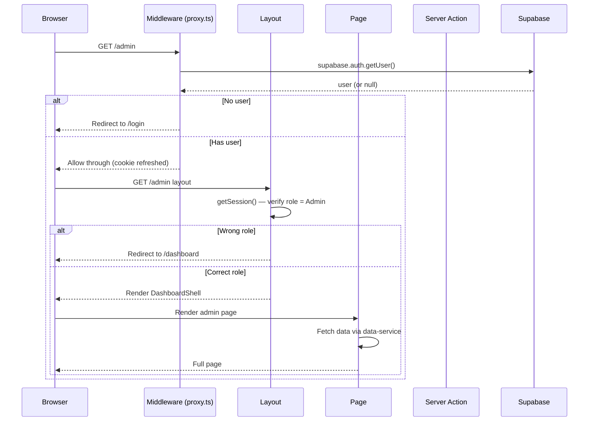

# attanDANCE — Project Documentation

## Table of Contents

1. [Introduction](#1-introduction)
2. [Tech Stack Primer](#2-tech-stack-primer)
3. [Project Architecture](#3-project-architecture)
4. [Setup Guide](#4-setup-guide)
5. [How It Works](#5-how-it-works)
6. [Features & Capabilities](#6-features--capabilities)
7. [Database Schema](#7-database-schema)
8. [Security Model](#8-security-model)
9. [Deployment](#9-deployment)
10. [Development Workflow](#10-development-workflow)

---

## 1. Introduction

**attanDANCE** is a full-stack dance club management and social platform. It serves as the central hub for the attanDANCE dance club, allowing administrators to manage the club, instructors to track their classes and students, and members to engage with a social feed, track their attendance, and manage their profiles.

The application supports **three distinct roles** — Admin, Instructor, and Member — each with different levels of access and capabilities. The landing page acts as a public storefront to attract new members, while authenticated users are redirected to their role-specific dashboards.

---

## 2. Tech Stack Primer

### 2.1 Next.js (v16)

**Next.js** is a React-based framework for building web applications. This project uses the **App Router** (introduced in Next.js 13, the standard in v16), which organizes routes based on the folder structure inside the `app/` directory.

**Key concepts used in this project:**

| Concept | Description |
|---|---|
| **Server Components** | By default, all components in `app/` are React Server Components. They render on the server, can be `async`, and can directly access databases and cookies without an API layer. |
| **Client Components** | Marked with `'use client'` at the top. Used for interactivity (forms, state, event handlers). Found in `components/features/`. |
| **Server Actions** | Functions marked with `'use server'` that run on the server. Used for form submissions (login, register, logout). Found in `lib/auth/actions.ts`. |
| **Route Groups** | Folders in parentheses like `(auth)/` that group routes without affecting the URL path. |
| **Middleware (Proxy)** | `proxy.ts` runs before every request. It refreshes the Supabase session cookie and enforces route protection. |
| **File-based Routing** | The folder structure inside `app/` determines the URL routes. For example, `app/admin/users/page.tsx` → `/admin/users`. |
| **Layouts** | `layout.tsx` files wrap child routes with shared UI (sidebar, header). Nested layouts compose automatically. |

### 2.2 Supabase

**Supabase** is an open-source backend-as-a-service built on PostgreSQL. It provides:

| Service | How it's used in this project |
|---|---|
| **Auth** | User sign-up, sign-in, session management. Supabase manages the `auth.users` table and issues JWTs via secure cookies. |
| **Database (PostgreSQL)** | All application data lives in `public.*` tables inside a PostgreSQL database. |
| **Row Level Security (RLS)** | Every table has RLS policies that restrict which rows a user can read or write based on their authenticated identity and role. |
| **Supabase JS Client** | `@supabase/supabase-js` (browser) and `@supabase/ssr` (server) provide typed APIs for querying the database and managing auth. |

**Auth flow in this project:**
- `auth.users` stores user credentials (managed by Supabase)
- `public.profiles` extends `auth.users` with app-specific data (full name, role)
- Supabase manages session cookies automatically; the app reads the authenticated user via `supabase.auth.getUser()`

### 2.3 Other Key Libraries

| Library | Purpose |
|---|---|
| **React 19** | UI framework |
| **TypeScript** | Type safety across the entire codebase |
| **Tailwind CSS v4** | Utility-first CSS styling |
| **shadcn/ui** | Accessible UI components (Button, Input, Card, Dialog, etc.) |
| **Zod** | Schema validation for forms |
| **React Hook Form** | Form state management with validation |
| **Sonner** | Toast notifications |
| **pnpm** | Package manager (with workspace support) |
| **Netlify** | Deployment platform |

---

## 3. Project Architecture

### 3.1 Directory Structure Overview

```
bird-project/
├── app/                          # Next.js App Router pages & layouts
│   ├── page.tsx                  # Root — smart router (landing ↔ dashboard redirect)
│   ├── layout.tsx                # Root HTML layout (fonts, metadata, toaster)
│   ├── globals.css               # Tailwind + shadcn + CSS variables
│   ├── (auth)/                   # Route group: auth pages (no sidebar wrapping)
│   │   ├── login/page.tsx
│   │   └── register/page.tsx
│   ├── auth/callback/route.ts    # Supabase Auth callback handler
│   ├── admin/                    # Admin-only section
│   │   ├── layout.tsx            # Role gate + DashboardShell (admin variant)
│   │   ├── page.tsx
│   │   ├── users/page.tsx
│   │   ├── artists/page.tsx
│   │   ├── attendance/page.tsx
│   │   ├── injuries/page.tsx
│   │   └── posts/page.tsx
│   ├── instructor/               # Instructor-only section
│   │   ├── layout.tsx            # Role gate + DashboardShell (instructor variant)
│   │   └── ...
│   └── dashboard/                # Member-facing section
│       ├── layout.tsx            # Role gate + DashboardShell (member variant)
│       ├── page.tsx
│       ├── posts/[id]/page.tsx   # Individual post view
│       ├── profile/page.tsx
│       ├── attendance/page.tsx
│       └── settings/page.tsx
│
├── components/
│   ├── ui/                       # shadcn primitives (Button, Input, Card, Label, etc.)
│   ├── layout/
│   │   └── dashboard-shell.tsx   # Shared sidebar + main content wrapper
│   └── features/
│       ├── admin/                # Admin-specific feature components
│       ├── auth/                 # Login & Register forms (client components)
│       ├── dashboard/            # Member dashboard components
│       ├── instructor/           # Instructor feature components
│       ├── landing/              # Public landing page components
│       └── shared/               # Reusable components across roles
│
├── lib/                          # Business logic & data access
│   ├── types.ts                  # TypeScript interfaces for all entities
│   ├── utils.ts                  # General utilities (cn, etc.)
│   ├── env.ts                    # Environment config helpers (DUMMY_MODE flag)
│   ├── data-service.ts           # Unified data access layer (dummy ↔ Supabase)
│   ├── dummy-data.ts             # Mock data for development without Supabase
│   ├── admin-actions.ts          # Server Actions for admin operations
│   ├── admin-data.ts             # Data queries for admin views
│   ├── instructor-actions.ts     # Server Actions for instructor operations
│   ├── instructor-data.ts        # Data queries for instructor views
│   ├── dashboard-actions.ts      # Server Actions for member operations
│   └── auth/                     # Authentication module
│       ├── actions.ts            # Server Actions (login, register, logout, verify OTP)
│       ├── service.ts            # Auth service (dummy ↔ Supabase switch)
│       ├── session.ts            # getSession() — server-side user resolution
│       ├── schemas.ts            # Zod validation schemas
│       └── types.ts              # Auth-specific types
│
├── utils/supabase/               # Supabase client helpers
│   ├── client.ts                 # Browser client (for client components)
│   ├── server.ts                 # Server client (for server components & actions)
│   ├── admin.ts                  # Service-role client (bypasses RLS, server-only)
│   └── middleware.ts             # Legacy middleware helper
│
├── supabase/                     # Supabase local development & migrations
│   ├── config.toml               # Supabase CLI configuration
│   ├── schema.sql                # Full schema reference
│   ├── seed.sql                  # Development seed data
│   └── migrations/               # Migration history (applied in order)
│       ├── ..._create_core_tables.sql
│       ├── ..._create_tracking_tables.sql
│       ├── ..._create_social_tables.sql
│       ├── ..._add_rls_and_profiles_trigger.sql
│       ├── ..._grant_api_access.sql
│       ├── ..._fix_recursive_profile_role_policy.sql
│       ├── ..._add_instructor_assignment_model.sql
│       └── ..._allow_owned_reaction_updates.sql
│
├── docs/                         # Documentation
│   ├── documentation.md          # This file
│   ├── attanDANCE_ERD_Schema.md  # ERD & schema reference
│   ├── auth.md                   # Authentication plan
│   ├── landing.md                # Landing page & routing plan
│   └── supabase-implementation-guide.md
│
├── proxy.ts                      # Next.js middleware — auth & route protection
├── next.config.ts                # Next.js configuration
├── tsconfig.json                 # TypeScript configuration
├── package.json                  # Dependencies & scripts
├── netlify.toml                  # Netlify deployment configuration
├── components.json               # shadcn/ui configuration
├── eslint.config.mjs             # ESLint configuration
├── postcss.config.mjs            # PostCSS configuration
└── pnpm-lock.yaml                # Locked dependency versions
```

### 3.2 Data Flow

```mermaid
flowchart TD
    subgraph Browser
        PC[Page / Client Component]
        FORM[Form Submission]
    end

    subgraph "Next.js Server"
        SA[Server Actions]
        SS[getSession()]
        DS[Data Service]
    end

    subgraph Supabase
        AUTH[Auth — auth.users]
        DB[(PostgreSQL — public.*)]
        RLS[RLS Policies]
    end

    PC -->|reads data| DS
    FORM -->|calls| SA
    SA -->|validates + calls| SS
    SA -->|reads/writes| DS
    DS -->|queries| DB
    DS -->|checks session| AUTH
    RLS -->|protects| DB
    SS -->|getUser()| AUTH
    SS -->|profile lookup| DB
```

**Key principle:** Server Components and Server Actions talk directly to Supabase — there is no separate API layer. RLS ensures that even if a query is made, only authorized rows are returned.

### 3.3 Dummy Mode

The application has a **dual-mode data layer** controlled by the environment variable `DUMMY_DATA_ENABLED`:

| Mode | `DUMMY_DATA_ENABLED` | Behavior |
|---|---|---|
| **Dummy (dev)** | `true` | Uses hard-coded mock data from `lib/dummy-data.ts`. Auth uses a simple `auth-token` cookie. No database required. |
| **Real (production)** | `false` | Uses Supabase Auth + PostgreSQL via the data service. Requires a running Supabase project. |

This allows rapid UI development without a database, and seamless switching to real data when ready.

---

## 4. Setup Guide

### 4.1 Prerequisites

- **Node.js** ≥ 20
- **pnpm** (install via `npm install -g pnpm` or `corepack enable`)
- **Supabase CLI** (optional, for local dev with database)
- **A Supabase account** (for production or remote dev database)

### 4.2 Quick Start (Dummy Mode — No Database)

```bash
# 1. Clone & install
cd bird-project
pnpm install

# 2. Start dev server (defaults to dummy mode)
pnpm dev

# 3. Open http://localhost:3000
```

Dummy mode uses mock data, so you can log in with any dummy user (e.g., `sakura.tanaka@attandance.com`, password: `password123`). All features work without a database.

### 4.3 Full Setup (Supabase Mode)

```bash
# 1. Install dependencies
pnpm install

# 2. Start Supabase locally
npx supabase start

# 3. Copy the environment variables from Supabase CLI output
#    and create .env.local:
```

**.env.local:**

```bash
NEXT_PUBLIC_SUPABASE_URL=http://127.0.0.1:54321
NEXT_PUBLIC_SUPABASE_PUBLISHABLE_KEY=your-publishable-key
SUPABASE_SECRET_KEY=your-secret-key
DUMMY_DATA_ENABLED=false
```

```bash
# 4. Apply migrations to local database
npx supabase db reset

# 5. Start the dev server
pnpm dev

# 6. Create test users via the Supabase dashboard or API
#    Navigate to http://127.0.0.1:54323 → Authentication → Users → Add User
#    Then insert matching profile rows in public.profiles
```

### 4.4 Environment Variables

| Variable | Required | Description |
|---|---|---|
| `NEXT_PUBLIC_SUPABASE_URL` | Real mode only | Supabase project URL (safe to expose) |
| `NEXT_PUBLIC_SUPABASE_PUBLISHABLE_KEY` | Real mode only | Supabase publishable (anon) key |
| `SUPABASE_SECRET_KEY` | Real mode only | Service-role key (server-only, never expose) |
| `DUMMY_DATA_ENABLED` | Always | `true` = mock data, `false` = real Supabase |

### 4.5 Scripts

| Command | Purpose |
|---|---|
| `pnpm dev` | Start the Next.js development server |
| `pnpm build` | Build for production |
| `pnpm start` | Start the production server |
| `pnpm lint` | Run ESLint for code quality |
| `pnpm typecheck` | Run TypeScript type checking (no emit) |
| `pnpm qa` | Run lint + typecheck + build (full QA) |
| `pnpm deploy` | Deploy to Netlify (preview) |
| `pnpm deploy:prod` | Deploy to Netlify (production) |

---

## 5. How It Works

### 5.1 Request Lifecycle

Every request flows through these layers:

1. **Middleware (`proxy.ts`)** — Runs first. Refreshes the Supabase session cookie. Routes are checked:
   - Public routes (`/`, `/login`, `/register`) → allowed through
   - Static assets (`/_next/*`) → allowed through
   - Authenticated routes → redirect to `/login` if no session
   - Auth pages (`/login`, `/register`) → redirect authenticated users to `/`

2. **Layout (`layout.tsx`)** — The root layout wraps every page with HTML structure, fonts, and the Sonner toast system.

3. **Page-level Layout** (e.g., `admin/layout.tsx`) — Role-gated layouts that:
   - Call `getSession()` to verify the user is authenticated
   - Check the user's role matches the section
   - Render the `DashboardShell` with appropriate navigation

4. **Page Component** — Renders the actual content. Typically a Server Component that fetches data and passes it to Client Components.

5. **Client Components** — Handle interactivity (forms, buttons, dialogs). Call Server Actions for mutations.

### 5.2 Authentication Flow



**Registration flow:**

1. User submits the register form → `registerAction()` (Server Action)
2. Action validates input with Zod schema
3. `auth.service.ts` calls `supabase.auth.signUp()` with email + password
4. On success, a profile row is inserted into `public.profiles` with the chosen role
5. If email verification is enabled, user is redirected to `/register/verify` for OTP
6. Otherwise, user is redirected to their role dashboard

**Login flow:**

1. User submits login form → `loginAction()` (Server Action)
2. Action validates input, calls `supabase.auth.signInWithPassword()`
3. Supabase sets secure session cookies
4. User is redirected to `/` → root page detects session → redirects to role dashboard

### 5.3 Role-Based Access Control

| Route Prefix | Allowed Roles | Gate Location |
|---|---|---|
| `/admin/*` | Admin only | `app/admin/layout.tsx` |
| `/instructor/*` | Instructor only | `app/instructor/layout.tsx` |
| `/dashboard/*` | Any authenticated user | `app/dashboard/layout.tsx` |
| `/`, `/login`, `/register` | Public | `proxy.ts` (unauth allowed) |
| `/auth/callback` | Public | `proxy.ts` |

**Double-gating:** Role checks happen at both the middleware level (is the user authenticated?) and the layout level (does the user have the right role?). This ensures defense in depth.

### 5.4 Smart Root Router

The root page (`app/page.tsx`) is a smart router:

- **No session** → Renders the public landing page (storefront)
- **Admin** → Redirects to `/admin`
- **Instructor** → Redirects to `/instructor`
- **Member** → Redirects to `/dashboard`

This means authenticated users never see the landing page on subsequent visits — they go straight to their workspace.

---

## 6. Features & Capabilities

### 6.1 Landing Page (Public)

The landing page serves as the public storefront to attract new members:

- Club branding and introduction
- Showcase of dance styles and community
- Call-to-action to register
- Links to login for existing members

### 6.2 Admin Dashboard

Full platform management for club administrators:

- **Dashboard** — Overview of club metrics and activity
- **User Management** — View, create, and manage all users and their roles
- **Artist Records** — Manage artist profiles (stage names, specialties, join dates)
- **Attendance Tracking** — View and manage all attendance records across the club
- **Injury Management** — Log and track all injuries, update recovery status
- **Content Moderation** — View and manage all posts across the platform

### 6.3 Instructor Dashboard

Tools for instructors to manage their classes and students:

- **Dashboard** — Overview of classes and student progress
- **Attendance** — Mark attendance for class sessions (Present, Absent, Late)
- **Injuries** — Log and track student injuries with severity and recovery status
- **Artists** — View student artist profiles and progress
- **Posts** — Create announcements, share class highlights, and engage with the community

### 6.4 Member Dashboard

Social and personal features for club members:

- **Social Feed** — Browse posts from instructors and fellow members
- **Post Detail** — View individual posts with comments and reactions
- **Comments & Reactions** — Engage with posts via comments and reactions (Like, Celebrate, Fire, Love, Insightful)
- **Profile** — View personal profile and artist record (stage name, specialty, join date)
- **Attendance** — View personal attendance history
- **Settings** — Manage account settings

### 6.5 Authentication System

- Email + password registration with validation
- Email OTP verification (optional)
- Secure login with Supabase Auth
- Session persistence via secure cookies
- Logout with session termination
- Role-based redirects after authentication

---

## 7. Database Schema

The database follows the ERD defined in [`attanDANCE_ERD_Schema.md`](./attanDANCE_ERD_Schema.md). Tables are in the `public` schema and extend Supabase's `auth.users`.

### 7.1 Table Summary

| Table | Purpose | Key Relationships |
|---|---|---|
| `roles` | Authorization levels (Admin, Instructor, Member) | Referenced by `profiles.role_id` |
| `profiles` | App-level user data | `id` references `auth.users(id)` |
| `artist_records` | Dance profiles for performers | `user_id` → `profiles.id`, `instructor_id` → `profiles.id` |
| `attendance` | Class/rehearsal presence tracking | `artist_record_id` → `artist_records.id` |
| `injuries` | Injury logging and recovery tracking | `artist_record_id` → `artist_records.id` |
| `posts` | Social content and announcements | `user_id` → `profiles.id` |
| `comments` | Replies on posts | `post_id` → `posts.id`, `user_id` → `profiles.id` |
| `reactions` | Likes and emoji reactions on posts | `post_id` → `posts.id`, `user_id` → `profiles.id` |

### 7.2 Key Design Decisions

- **`profiles` not `users`:** Supabase's `auth.users` already exists. The `profiles` table extends it with app-specific fields (full name, role) and references `auth.users(id)` with `ON DELETE CASCADE`.
- **No `password_hash` in profiles:** Passwords are managed entirely by Supabase Auth. The app never touches password data.
- **`artist_records` is separate from `profiles`:** Not every user is an artist. Users get an artist record only when they join as performers.
- **Instructor assignment:** `artist_records.instructor_id` links students to their assigned instructor.

### 7.3 Migrations

Migrations are tracked in `supabase/migrations/` and applied in chronological order:

| Migration | Purpose |
|---|---|
| `20260618172847` | Core tables: `roles`, `profiles`, `artist_records` |
| `20260618172849` | Tracking tables: `attendance`, `injuries` |
| `20260618172850` | Social tables: `posts`, `comments`, `reactions` |
| `20260618175308` | RLS policies + auto-profile trigger |
| `20260618175650` | Grant API access to roles |
| `20260619083522` | Fix recursive profile role policy |
| `20260619113000` | Add instructor assignment model |
| `20260619153343` | Allow users to update their own reactions |

---

## 8. Security Model

### 8.1 Row Level Security (RLS)

Every table in the `public` schema has RLS enabled. Policies restrict data access based on the authenticated user:

| Table | Read Policy | Write Policy |
|---|---|---|
| `roles` | Anyone can read (public reference data) | No direct writes (managed by migrations) |
| `profiles` | Users read their own; Admins read all | Users insert/update their own |
| `artist_records` | All authenticated users can read | Users insert their own |
| `attendance` | All authenticated users can read | Instructors & Admins can manage |
| `injuries` | All authenticated users can read | Instructors & Admins can manage |
| `posts` | All authenticated users can read | All authenticated users can create; owners can update/delete |
| `comments` | All authenticated users can read | All authenticated users can create; owners can update/delete |
| `reactions` | All authenticated users can read | All authenticated users can create/update/delete their own |

### 8.2 Security Principles

- **All authorization is server-side.** Client-side UI hiding is for UX only — real enforcement happens in RLS and Server Components.
- **`auth.uid()` is the source of truth.** Policies use `(SELECT auth.uid())` to identify the current user — not JWT claims, not cookies, not URL params.
- **UPDATE requires `USING` + `WITH CHECK`.** Both clauses are specified to prevent privilege escalation (e.g., reassigning a row's `user_id` to another user).
- **Service-role key is server-only.** The `admin` Supabase client (bypassing RLS) is only used in server-side code and never exposed to the browser.
- **No `NEXT_PUBLIC_*` secrets.** The Supabase publishable key is safe for the browser; the secret key is in `SUPABASE_SECRET_KEY` (no `NEXT_PUBLIC_` prefix).

### 8.3 Middleware Protection

`proxy.ts` enforces route-level protection:

- Unauthenticated users can only access `/`, `/login`, `/register`, and static assets
- All other routes redirect unauthenticated users to `/login`
- Authenticated users on auth pages are redirected to `/`
- Role-specific gating happens in page layouts (not middleware — keeps middleware lightweight)

---

## 9. Deployment

### 9.1 Netlify Deployment

The project is configured for deployment on Netlify:

```bash
# Preview deploy
pnpm deploy

# Production deploy
pnpm deploy:prod
```

**Netlify configuration (`netlify.toml`):**
- Build command: `pnpm build`
- Publish directory: `.next`
- Production: `DUMMY_DATA_ENABLED=false`
- Preview/Deploy Preview: `DUMMY_DATA_ENABLED=true`
- Security headers set for all routes
- Long-lived caching for static assets

### 9.2 Supabase Setup for Production

1. Create a Supabase project at [supabase.com](https://supabase.com)
2. Push migrations: `npx supabase db push`
3. Configure Auth settings:
   - Site URL: your Netlify domain
   - Redirect URLs: `https://your-site.netlify.app/auth/callback`
4. Set environment variables in Netlify UI (Site configuration → Environment variables)
5. Seed initial roles data if not already migrated

---

## 10. Development Workflow

### 10.1 Quality Assurance

Before committing, run the full QA suite:

```bash
pnpm qa    # Runs lint + typecheck + build
```

Or run individually:

```bash
pnpm lint        # ESLint — code style & best practices
pnpm typecheck   # TypeScript — type safety verification
pnpm build       # Production build — catch build-time errors
```

### 10.2 Schema Changes (Supabase)

When changing the database schema:

1. **Iterate with direct SQL:** Use `execute_sql` (MCP) or `supabase db query` to test changes on the local database without writing migration history.
2. **Review security:** Check RLS policies, ensure no `SECURITY DEFINER` leaks, verify `USING` + `WITH CHECK` on UPDATE policies.
3. **Run advisors:** `supabase db advisors` to catch common issues.
4. **Generate migration:** `supabase db pull <descriptive-name> --local --yes`
5. **Verify:** `supabase migration list --local`

### 10.3 Code Organization Conventions

- **Server Components** are used for pages and layouts (in `app/`). They can be `async` and fetch data directly.
- **Client Components** are in `components/features/` and handle interactivity (forms, state, event handlers).
- **Server Actions** (in `lib/*-actions.ts`) handle mutations (create, update, delete).
- **Data access** goes through `lib/data-service.ts` which abstracts dummy ↔ real switching.
- **Auth logic** lives in `lib/auth/` and is the single source of truth for session resolution.
- **Environment checks** use `lib/env.ts` instead of direct `process.env` access.

### 10.4 Adding a New Feature

1. Define/update types in `lib/types.ts`
2. Add a migration in `supabase/migrations/` (if schema change needed)
3. Add data queries to `lib/data-service.ts` (or role-specific data files)
4. Create Server Actions in `lib/*-actions.ts` for mutations
5. Build the page in `app/` (Server Component)
6. Build interactive features in `components/features/` (Client Components)
7. Write RLS policies to secure the new data
8. Run `pnpm qa` to verify everything passes

---

> **Documentation version:** 1.0 — last updated 2026-06-28
