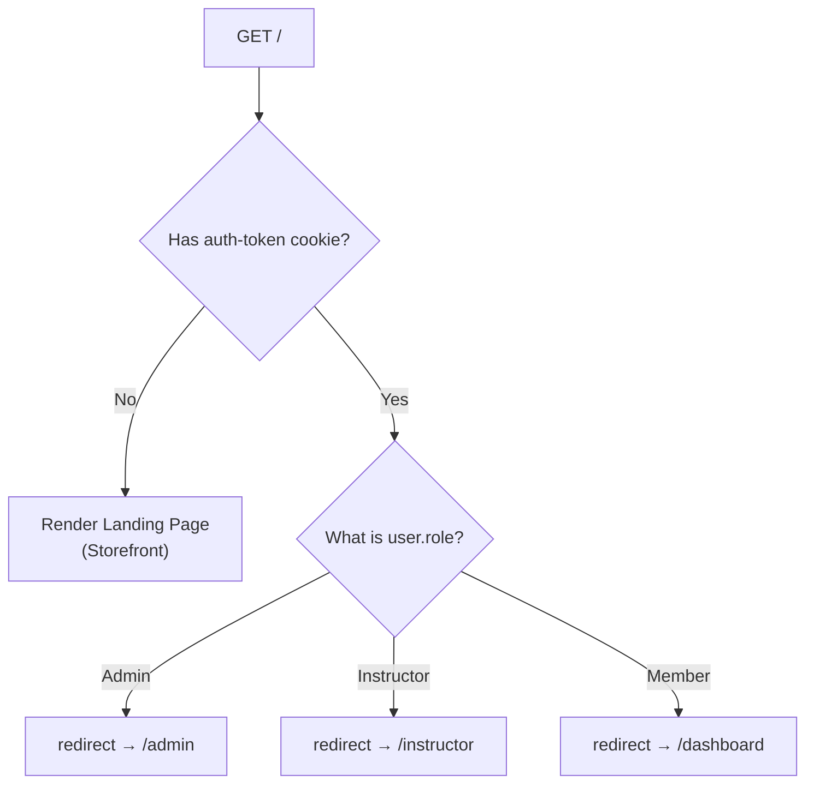
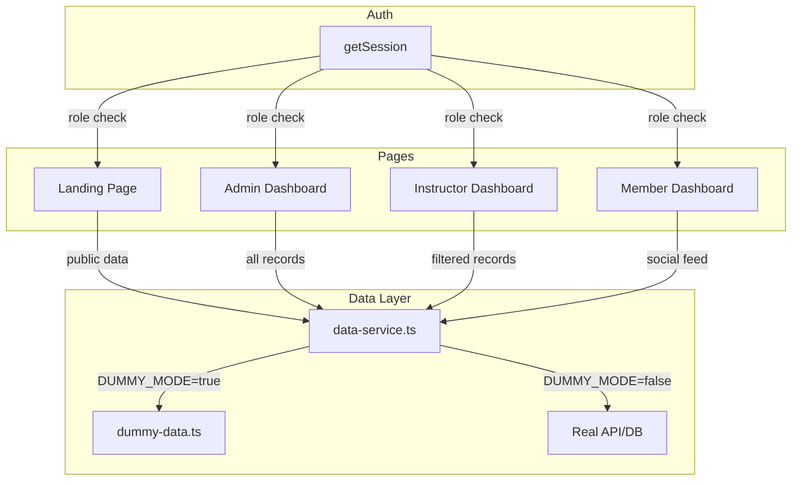

# attanDANCE — Landing Page & Role-Based Dashboards Plan

---

## 1. Overview

The app has **three role-gated sections** powered by the existing auth system:

| Section | Audience | Auth Required | Purpose |
|---|---|---|---|
| **Storefront** (Landing) | Public / unauthenticated | No | Attract new members, showcase the club, CTA to join |
| **Admin Panel** | Admin role only | Yes (role check) | Full platform management: users, artists, attendance, injuries, content |
| **Instructor Panel** | Instructor role only | Yes (role check) | Manage attendance, log injuries, post content, view artist progress |
| **Member Dashboard** | Member role | Yes (role check) | Social feed — browse posts, comment, react, track personal attendance & profile |

---

## 2. Routing Map

```
/                               → Landing page (unauth) OR redirects role-based (auth)
├── /login                      → Sign in
├── /register                   → Create account
│
├── /admin/                     → Admin dashboard (Admin only)
│   ├── /admin/users            → User management
│   ├── /admin/artists          → Artist records
│   ├── /admin/attendance       → All attendance records
│   ├── /admin/injuries         → Injury logs & status
│   └── /admin/posts            → Content moderation
│
├── /instructor/                → Instructor dashboard (Instructor only)
│   ├── /instructor/attendance  → Manage class attendance
│   ├── /instructor/injuries    → Log & track injuries
│   ├── /instructor/artists     → My artists / students
│   └── /instructor/posts       → Create & manage posts
│
└── /dashboard/                 → Member feed (any authenticated user)
    ├── /dashboard/posts        → Social feed
    ├── /dashboard/profile      → My profile & artist record
    └── /dashboard/attendance   → My attendance history
```

---

## 3. Root Route Logic (`/`)

The root page acts as a **smart router** — it checks session and redirects based on role:



**Implementation**: `app/page.tsx` becomes a Server Component that calls `getSession()`, then:
- `null` → renders `<LandingPage />` (the storefront)
- `role === 'Admin'` → `redirect('/admin')`
- `role === 'Instructor'` → `redirect('/instructor')`
- `role === 'Member'` → `redirect('/dashboard')`

---

## 4. Proxy (Middleware) Updates

The current proxy protects all routes. Update it to:

| Route Pattern | Unauthenticated | Authenticated |
|---|---|---|
| `/login`, `/register` | Allow | Redirect to role dashboard |
| `/admin/*` | Redirect to `/login` | Allow if Admin; else 403 |
| `/instructor/*` | Redirect to `/login` | Allow if Instructor; else 403 |
| `/dashboard/*` | Redirect to `/login` | Allow (any role) |
| `/` (root) | Allow (landing page) | Allow (handled by page logic) |
| `/_next/*`, `/api/*`, static | Allow | Allow |

### Proxy pseudocode:

```typescript
// proxy.ts
const publicRoutes = ['/login', '/register', '/'];
const roleRoutes: Record<string, string[]> = {
  '/admin': ['Admin'],
  '/instructor': ['Instructor'],
};

export default function proxy(request: NextRequest) {
  const token = request.cookies.get('auth-token')?.value;
  const { pathname } = request.nextUrl;

  // 1. Public routes — allow through
  if (publicRoutes.some(r => pathname === r || pathname === r + '/')) {
    return NextResponse.next();
  }

  // 2. Static assets — allow
  if (pathname.startsWith('/_next') || pathname.startsWith('/api')) {
    return NextResponse.next();
  }

  // 3. Unauthenticated → login
  if (!token) {
    return NextResponse.redirect(new URL('/login', request.url));
  }

  // 4. Role-gated routes — check via header set by getSession
  // (role resolution happens in layout.tsx or per-page)
  // For now, allow authenticated through — page-level checks handle role enforcement

  return NextResponse.next();
}
```

> **Note**: Full role enforcement is done at the **page / layout level** via `getSession()` + role check, not in proxy, because the proxy doesn't have access to the session data (only the cookie). We could set a `X-User-Role` header, but page-level guards are simpler and more maintainable.

---

## 5. Role-Based Layout Architecture

```
app/
├── (storefront)/                 # Route group — no layout wrapping
│   └── page.tsx                  # Landing Page (public)
│
├── (auth)/                       # Already exists
│   ├── login/page.tsx
│   └── register/page.tsx
│
├── (admin)/                      # Route group — Admin layout
│   ├── layout.tsx                # Admin sidebar + role guard
│   ├── page.tsx                  # Admin dashboard overview
│   ├── users/page.tsx
│   ├── artists/page.tsx
│   ├── attendance/page.tsx
│   ├── injuries/page.tsx
│   └── posts/page.tsx
│
├── (instructor)/                 # Route group — Instructor layout
│   ├── layout.tsx                # Instructor sidebar + role guard
│   ├── page.tsx                  # Instructor dashboard overview
│   ├── attendance/page.tsx
│   ├── injuries/page.tsx
│   ├── artists/page.tsx
│   └── posts/page.tsx
│
└── (dashboard)/                  # Route group — Member layout
    ├── layout.tsx                # Member nav + auth guard
    ├── page.tsx                  # Social feed
    ├── profile/page.tsx
    └── attendance/page.tsx
```

Each route group has its own `layout.tsx` that:
1. Calls `getSession()`
2. Checks the user's role
3. If unauthorized → `redirect('/login')` or shows 403
4. Renders a role-specific sidebar/nav + the child page

### Layout Guard Pattern

```typescript
// app/(admin)/layout.tsx
import { redirect } from 'next/navigation';
import { getSession } from '@/lib/auth/session';
import { AdminSidebar } from '@/components/layout/admin-sidebar';

export default async function AdminLayout({ children }: { children: React.ReactNode }) {
  const session = await getSession();
  if (!session) redirect('/login');
  if (session.role !== 'Admin') redirect('/dashboard');

  return (
    <div className="flex min-h-screen">
      <AdminSidebar user={session} />
      <main className="flex-1 p-8">{children}</main>
    </div>
  );
}
```

---

## 6. Storefront — Landing Page Design

### 6.1 Purpose
Convert visitors into members. Showcase the club's energy, culture, and value.

### 6.2 Sections (scroll-driven narrative)

```
┌──────────────────────────────────────────┐
│  NAV:  Logo   [Features] [About] [Join]  │  ← Sticky, hide on scroll down
│                                          │
│  ═══════════ HERO ══════════════════════ │
│  ┌────────────────────────────────────┐  │
│  │  Full-viewport video/gradient bg   │  │
│  │  attanDANCE — Move With Us         │  │
│  │  Join the city's most vibrant      │  │
│  │  dance community.                  │  │
│  │  [Join Now]  [Learn More ↓]       │  │
│  └────────────────────────────────────┘  │
│                                          │
│  ═══════════ FEATURES ═════════════════  │
│  ┌─────────┐ ┌─────────┐ ┌─────────┐   │
│  │ Classes │ │ Events  │ │ Connect │   │
│  │ 12+     │ │ Monthly │ │ Social  │   │
│  │ styles  │ │ battles │ │ feed    │   │
│  └─────────┘ └─────────┘ └─────────┘   │
│                                          │
│  ═══════════ ABOUT ════════════════════  │
│  │  Our story, mission, instructors    │  │
│                                          │
│  ═══════════ TESTIMONIALS ════════════  │
│  │  Carousel of member quotes          │  │
│                                          │
│  ═══════════ CTA ═════════════════════  │
│  │  "Ready to move?" [Join Now]        │  │
│                                          │
│  FOOTER: Links, social, copyright       │
└──────────────────────────────────────────┘
```

### 6.3 Component Tree

```
components/
├── features/
│   └── landing/
│       ├── hero.tsx              # Full-bleed hero with animated headline
│       ├── nav-bar.tsx           # Sticky nav, scroll-aware
│       ├── features-section.tsx  # 3-card feature grid
│       ├── about-section.tsx     # Club story + instructor highlights
│       ├── testimonials.tsx      # Quote carousel
│       ├── cta-section.tsx       # Final call-to-action
│       └── footer.tsx            # Site footer
```

### 6.4 Styling Direction
Follow the **premium-frontend-ui** skill:
- Dark theme with glowing accent colors
- Scroll-driven reveals (staggered fade-ups)
- Smooth scrolling via Lenis or CSS `scroll-behavior: smooth`
- Glassmorphism cards for feature tiles
- JetBrains Mono for headlines, Noto Sans for body
- Performance: all animations on `transform` + `opacity`

---

## 7. Admin Panel — Dashboard Design

### 7.1 Layout

```
┌──────────┬──────────────────────────────────────┐
│ Sidebar  │  Header:  [Search]  [Notifications]  │
│          │  [User avatar ▼]                     │
│ ───────  ├──────────────────────────────────────┤
│ 📊 Dashboard                                   │
│ 👥 Users       ┌──────────┬──────────┬────────┐ │
│ 🎨 Artists     │ Total    │ Active   │ New    │ │
│ 📋 Attendance  │ Members  │ Artists  │ This   │ │
│ 🏥 Injuries    │ 48       │ 32       │ Month  │ │
│ 📝 Posts       │          │          │ 5      │ │
│                └──────────┴──────────┴────────┘ │
│                ┌──────────────────────────────┐ │
│ [Logout]       │ Recent Attendance (table)    │ │
│                │ Name     Date    Status      │ │
│                │ Sakura   06/09   Present     │ │
│                │ Kai      06/09   Absent      │ │
│                └──────────────────────────────┘ │
│                ┌──────────────────────────────┐ │
│                │ Injury Status (summary)      │ │
│                │ 🟢 2 Recovering  🔴 1 Under  │ │
│                └──────────────────────────────┘ │
└──────────┴──────────────────────────────────────┘
```

### 7.2 Sub-pages

| Route | Content |
|---|---|
| `/admin` | Dashboard overview with stat cards, recent activity, injury summary |
| `/admin/users` | Table of all users — filter by role, search by name/email, edit/delete |
| `/admin/artists` | Table of artist records — stage name, specialty, join date |
| `/admin/attendance` | Full attendance log — filter by artist, date range, status |
| `/admin/injuries` | Injury log — filter by status, severity; update status |
| `/admin/posts` | All posts — moderation (hide/delete), view reports |

---

## 8. Instructor Panel — Dashboard Design

### 8.1 Layout

```
┌──────────┬──────────────────────────────────────┐
│ Sidebar  │  Header:  Welcome, Kai Yamamoto      │
│          │  [Notifications]                     │
│ ───────  ├──────────────────────────────────────┤
│ 📊 Dashboard                                   │
│ 📋 Attendance  ┌──────────┬──────────┬────────┐ │
│ 🏥 Injuries    │ My       │ Today's  │ This   │ │
│ 🎨 My Artists  │ Artists  │ Classes  │ Week's │ │
│ 📝 My Posts    │ 12       │ 3        │ Rate   │ │
│                │          │          │ 87%    │ │
│ [Logout]       └──────────┴──────────┴────────┘ │
│                ┌──────────────────────────────┐ │
│                │ Quick Actions                │ │
│                │ [Take Attendance] [Log       │ │
│                │  Injury] [New Post]          │ │
│                └──────────────────────────────┘ │
│                ┌──────────────────────────────┐ │
│                │ My Recent Attendance         │ │
│                │ (filtered to instructor's    │ │
│                │  assigned artists)           │ │
│                └──────────────────────────────┘ │
└──────────┴──────────────────────────────────────┘
```

### 8.2 Sub-pages

| Route | Content |
|---|---|
| `/instructor` | Dashboard overview — stat cards, quick actions, recent attendance |
| `/instructor/attendance` | Mark attendance for sessions — date picker, artist list, Present/Absent/Late toggles |
| `/instructor/injuries` | Log new injuries, view & update existing ones |
| `/instructor/artists` | List of assigned artists with attendance stats |
| `/instructor/posts` | Create, edit, delete own posts |

---

## 9. Member Dashboard — Feed & Profile Design

### 9.1 Purpose
The member dashboard is the social heart of attanDANCE. Members browse the feed, interact with posts (comments, reactions), check their own attendance, and manage their profile / artist record.

### 9.2 Layout

```
┌──────────┬──────────────────────────────────────┐
│ Sidebar  │  Header:  Welcome, Riko Sato         │
│          │  [Notifications 🔔]                  │
│ ───────  ├──────────────────────────────────────┤
│ 📰 Feed       ┌────────────────────────────┐   │
│ 👤 Profile    │  Create a post...           │   │
│ 📋 My         │  [What's on your mind?]     │   │
│   Attendance  │  [Post]                     │   │
│               └────────────────────────────┘   │
│               ┌────────────────────────────┐   │
│ [Logout]      │ 🔥 Kai Yamamoto · 2h ago   │   │
│               │ Hip-Hop Workshop Recap      │   │
│               │ Massive thanks to everyone   │   │
│               │ who showed up...            │   │
│               │ ❤️ 4  💬 2 comments         │   │
│               └────────────────────────────┘   │
│               ┌────────────────────────────┐   │
│               │ 🌙 Luna Park · 3h ago      │   │
│               │ New Jazz Fusion Routine     │   │
│               │ Been experimenting...       │   │
│               │ ❤️ 3  💬 2 comments         │   │
│               └────────────────────────────┘   │
│               ┌────────────────────────────┐   │
│               │ 📢 Sakura Tanaka · 1d ago  │   │
│               │ Schedule Change Next Week   │   │
│               │ Attention all members...    │   │
│               │ ❤️ 2  💬 1 comment          │   │
│               └────────────────────────────┘   │
└──────────┴──────────────────────────────────────┘
```

### 9.3 Sub-pages

| Route | Content |
|---|---|
| `/dashboard` | Social feed — all posts sorted by newest, with inline comments & reactions |
| `/dashboard/posts/[id]` | Single post detail — full post body, comment thread, reaction list |
| `/dashboard/profile` | My profile — name, email, role badge, artist record (stage name, specialty, join date) |
| `/dashboard/attendance` | My attendance history — table filtered to the current user's artist record |
| `/dashboard/settings` | Account settings — change password (future) |

### 9.4 Social Feed Features

**Post Card** (reusable):
- Author avatar + name + role badge + relative timestamp
- Post title (bold heading)
- Post body (truncated to 3 lines with "Read more" expand)
- Reaction bar: inline reaction counts (🔥 Like · 🎉 Celebrate · ❤️ Love)
- Comment count with link to expand thread
- **Reaction picker**: Hover over the reaction button to pick from emoji set
- **Quick comment**: Inline comment input that expands on focus

**Comment Thread** (inside post detail or expanded):
- Flat list of comments, newest first
- Each comment shows: author name, timestamp, content
- Quick reply input at bottom

### 9.5 Profile Page

```
┌──────────────────────────────────────────────┐
│  ┌────────┐                                  │
│  │ Avatar │  Riko Sato                       │
│  │ (init.)│  riko.sato@attandance.com        │
│  └────────┘  Member  ·  Joined Aug 2024      │
│                                              │
│  ── Artist Record ─────────────────────────  │
│  ┌────────────────────────────────────────┐  │
│  │ Stage Name    Riko Beat                │  │
│  │ Specialty     Street / Breaking         │  │
│  │ Join Date     Aug 10, 2024             │  │
│  └────────────────────────────────────────┘  │
│                                              │
│  ── Stats ────────────────────────────────  │
│  ┌──────────┐ ┌──────────┐ ┌──────────┐    │
│  │ 45       │ │ 12       │ │ 87%      │    │
│  │ Sessions │ │ Posts    │ │ Attend.  │    │
│  │ Attended │ │ Created  │ │ Rate     │    │
│  └──────────┘ └──────────┘ └──────────┘    │
│                                              │
│  ── Recent Activity ──────────────────────  │
│  │ Jun 9  ·  Present  ·  Morning class     │
│  │ Jun 8  ·  Commented on "Workshop Recap" │
│  │ Jun 7  ·  Absent   ·  Afternoon session │
└──────────────────────────────────────────────┘
```

### 9.6 Attendance History

A personal view of all the member's attendance records:

| Date | Session | Status | Notes |
|---|---|---|---|
| Jun 9, 2025 | Morning Class | ✅ Present | Full routine run-through |
| Jun 8, 2025 | Afternoon Session | ❌ Absent | — |
| Jun 5, 2025 | Evening Practice | ⏰ Late | Arrived 15 min late — traffic |
| Jun 3, 2025 | Morning Class | ✅ Present | — |

With summary stats at top: total sessions, attendance rate, streak.

### 9.7 Component Tree

```
components/
├── features/
│   └── dashboard/
│       ├── feed.tsx                  # Post list with infinite scroll / pagination
│       ├── post-card.tsx             # Individual post in feed
│       ├── post-detail.tsx           # Full post view with comments
│       ├── comment-list.tsx          # Comment thread
│       ├── comment-item.tsx          # Single comment
│       ├── reaction-picker.tsx       # Emoji reaction picker (popover)
│       ├── create-post-form.tsx      # New post composer
│       ├── profile-card.tsx          # Profile info + artist record
│       ├── profile-stats.tsx         # Stats cards (sessions, posts, rate)
│       ├── activity-timeline.tsx     # Recent activity feed
│       └── attendance-table.tsx      # Personal attendance table
│
├── layout/
│   └── member-sidebar.tsx            # Member navigation sidebar
```

### 9.8 Sidebar Navigation

```
┌──────────────┐
│  attanDANCE  │  ← Logo / brand
│ ──────────── │
│ 📰 Feed      │  ← Active state highlight
│ 👤 Profile   │
│ 📋 Attendance│
│ ⚙️ Settings  │
│ ──────────── │
│ 🚪 Logout    │
└──────────────┘
```

Green / Emerald accent color for the active nav item and stat highlights.

---

## 10. Shared Layout Components

```
components/
├── layout/
│   ├── admin-sidebar.tsx        # Admin navigation sidebar
│   ├── instructor-sidebar.tsx   # Instructor navigation sidebar
│   ├── member-sidebar.tsx       # Member navigation sidebar
│   ├── dashboard-header.tsx     # Shared header with user menu
│   ├── dashboard-shell.tsx      # Shared sidebar + header + main layout
│   └── nav-bar.tsx              # Landing page nav (reused from landing)
│
├── features/
│   └── shared/
│       ├── stat-card.tsx        # Reusable stat card (icon, value, label, trend)
│       ├── data-table.tsx       # Reusable shadcn-based data table
│       ├── status-badge.tsx     # Present/Absent/Late badge
│       └── role-guard.tsx       # Client-side role check wrapper
```

---

## 11. Data Flow



---

## 12. Implementation Phases

### Phase 1 — Routing & Role Guards
- [ ] Update `proxy.ts` — allow `/` through without auth; add role-route patterns
- [ ] Update `app/page.tsx` — smart router (landing vs role redirect)
- [ ] Create `app/(admin)/layout.tsx` — role guard + sidebar shell
- [ ] Create `app/(instructor)/layout.tsx` — role guard + sidebar shell
- [ ] Create `app/(dashboard)/layout.tsx` — auth guard + member nav
- [ ] Create `app/(storefront)/layout.tsx` — minimal layout (no auth)

### Phase 2 — Shared Components
- [ ] `components/layout/dashboard-shell.tsx` — reusable sidebar + content layout
- [ ] `components/layout/admin-sidebar.tsx` — admin nav
- [ ] `components/layout/instructor-sidebar.tsx` — instructor nav
- [ ] `components/layout/dashboard-header.tsx` — header with user menu + logout
- [ ] `components/features/shared/stat-card.tsx`
- [ ] `components/features/shared/data-table.tsx`
- [ ] `components/features/shared/status-badge.tsx`

### Phase 3 — Storefront (Landing Page)
- [ ] `components/features/landing/nav-bar.tsx` — sticky, scroll-aware nav
- [ ] `components/features/landing/hero.tsx` — full-bleed hero with animated headline
- [ ] `components/features/landing/features-section.tsx` — 3-card grid
- [ ] `components/features/landing/about-section.tsx` — club story
- [ ] `components/features/landing/testimonials.tsx` — quote carousel
- [ ] `components/features/landing/cta-section.tsx` — final CTA
- [ ] `components/features/landing/footer.tsx`
- [ ] `app/(storefront)/page.tsx` — compose all sections

### Phase 4 — Admin Panel Pages
- [ ] `app/(admin)/page.tsx` — dashboard overview with stats
- [ ] `app/(admin)/users/page.tsx` — user management table
- [ ] `app/(admin)/artists/page.tsx` — artist records table
- [ ] `app/(admin)/attendance/page.tsx` — attendance log
- [ ] `app/(admin)/injuries/page.tsx` — injury management
- [ ] `app/(admin)/posts/page.tsx` — content moderation

### Phase 5 — Instructor Panel Pages
- [ ] `app/(instructor)/page.tsx` — dashboard overview
- [ ] `app/(instructor)/attendance/page.tsx` — attendance management
- [ ] `app/(instructor)/injuries/page.tsx` — injury logging
- [ ] `app/(instructor)/artists/page.tsx` — assigned artists
- [ ] `app/(instructor)/posts/page.tsx` — manage own posts

### Phase 6 — Member Dashboard
- [ ] `components/layout/member-sidebar.tsx` — member nav with emerald accent
- [ ] `components/features/dashboard/feed.tsx` — post list with scroll
- [ ] `components/features/dashboard/post-card.tsx` — individual post card
- [ ] `components/features/dashboard/post-detail.tsx` — full post with comments
- [ ] `components/features/dashboard/comment-list.tsx` — comment thread
- [ ] `components/features/dashboard/comment-item.tsx` — single comment
- [ ] `components/features/dashboard/reaction-picker.tsx` — emoji reaction popover
- [ ] `components/features/dashboard/create-post-form.tsx` — post composer
- [ ] `components/features/dashboard/profile-card.tsx` — profile info + artist record
- [ ] `components/features/dashboard/profile-stats.tsx` — stats cards
- [ ] `components/features/dashboard/activity-timeline.tsx` — recent activity
- [ ] `components/features/dashboard/attendance-table.tsx` — personal attendance
- [ ] `app/(dashboard)/page.tsx` — social feed
- [ ] `app/(dashboard)/posts/[id]/page.tsx` — single post detail
- [ ] `app/(dashboard)/profile/page.tsx` — my profile
- [ ] `app/(dashboard)/attendance/page.tsx` — my attendance
- [ ] `app/(dashboard)/settings/page.tsx` — account settings

### Phase 7 — QA
- [ ] `pnpm lint` — zero warnings
- [ ] `pnpm typecheck` — zero errors
- [ ] `pnpm build` — successful
- [ ] Manual test: unauthenticated → landing page
- [ ] Manual test: login as Admin → `/admin`
- [ ] Manual test: login as Instructor → `/instructor`
- [ ] Manual test: login as Member → `/dashboard`
- [ ] Manual test: Admin cannot access `/instructor`
- [ ] Manual test: Instructor cannot access `/admin`

---

## 13. Quick Reference

| Role | Home Route | Sidebar Color Accent |
|---|---|---|
| Admin | `/admin` | Red / Rose |
| Instructor | `/instructor` | Blue / Sky |
| Member | `/dashboard` | Green / Emerald |
| Public | `/` (landing) | N/A |

| Test User | Email | Role | Lands on |
|---|---|---|---|
| Sakura Tanaka | `sakura.tanaka@attandance.com` | Admin | `/admin` |
| Kai Yamamoto | `kai.yamamoto@attandance.com` | Instructor | `/instructor` |
| Riko Sato | `riko.sato@attandance.com` | Member | `/dashboard` |
